# robotframework-RFCP-tutorials

Robotframework RFCP Tutorials

## Table of Contents
- [robotframework-RFCP-tutorials](#robotframework-rfcp-tutorials)
  - [Table of Contents](#table-of-contents)
  - [Installation Process](#installation-process)
    - [Local Installation](#local-installation)
      - [Python Installation](#python-installation)
      - [Visual Studio Code Installation](#visual-studio-code-installation)
      - [Download Robot Framework Examples](#download-robot-framework-examples)
      - [VS Code Extensions Installation](#vs-code-extensions-installation)
      - [Robot Framework Installation](#robot-framework-installation)
      - [Run Robot Framework Examples](#run-robot-framework-examples)
    - [Alternative Installation Processes](#alternative-installation-processes)
      - [Launching a Local DevContainer within VSCode](#launching-a-local-devcontainer-within-vscode)
      - [Using GitHub Codespaces with the Provided DevContainer](#using-github-codespaces-with-the-provided-devcontainer)

## Installation Process

### Local Installation

#### Python Installation

1. **Download Python**: Go to the [Python download page](https://www.python.org/downloads/) and download version 3.12. or higher.
2. **Run Installer**: Execute the downloaded installation file.
3. **Follow Guided Installation**: Proceed with the recommended installation steps.
4. **Default Installation Directory**: Python will be installed in the user directory by default.
5. **Optional**: You can specify a different installation directory if needed during the installation process.
6. **Verify Installation**:
    - Open the command line.
    - Run the command: `python --version`
    - You should see the installed Python version.
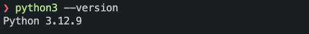

#### Visual Studio Code Installation

1. **Download Visual Studio Code**: Go to the [Visual Studio Code download page](https://code.visualstudio.com/Download) and download the installer.
2. **Run Installer**: Execute the downloaded installation file.
3. **Follow Guided Installation**: Proceed with the recommended installation steps.
4. **Verify Installation**: VS Code should start without issues and display the "Welcome" page.

#### Download Robot Framework Examples

1. **Download the repository provided from us**
2. **Extract Repository**: Use a tool like `7-zip` to extract the downloaded repository.
3. **Open Examples in VS Code**:
    - Open VS Code.
    - Click on `File` -> `Open Folder`.
    - Select and open the extracted folder.
    - The project should now be visible in the sidebar.

#### VS Code Extensions Installation

1. **Open VS Code**.
2. **Install Recommended Extensions**:
    - When you open the project in VS Code, you should see a prompt to install recommended extensions.
    - Click on "Install All" to install the recommended extensions.
3. **Alternatively, Manually Install Extensions**:
    - Open Extensions view by clicking on the "Extensions" icon in the sidebar on the left.
    - Search for and install the `RobotCode` extension.
    - Search for and install the `Python` extension.
4. **Restart VS Code**: The extensions should now be active.

#### Robot Framework Installation

1. **Open Command Line** in the project's root directory.
2. **Create a Virtual Environment**:
    - Run the command: `python -m venv .venv`
3. **Activate the Virtual Environment**:
    - On Windows: `.venv\Scripts\activate`
    - On macOS/Linux: `source .venv/bin/activate`
4. **Install Robot Framework and the libraries**: Run the command:

    ```sh
    pip install -r requirements.txt
    ```

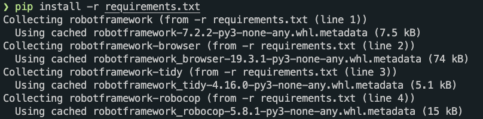

5. **Verify Installation**:
    - Open the command line.
    - Run the command: `robot --help`
    - You should see the Robot Framework help message.
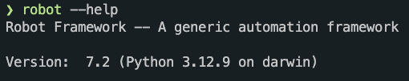

#### Run Robot Framework Examples

1. **Set Up Python Interpreter**:
    - Press `F1` in VS Code.
    - Search for `Python: Select Interpreter` and select the installed Python interpreter from the previously created virtual environment `.venv`.
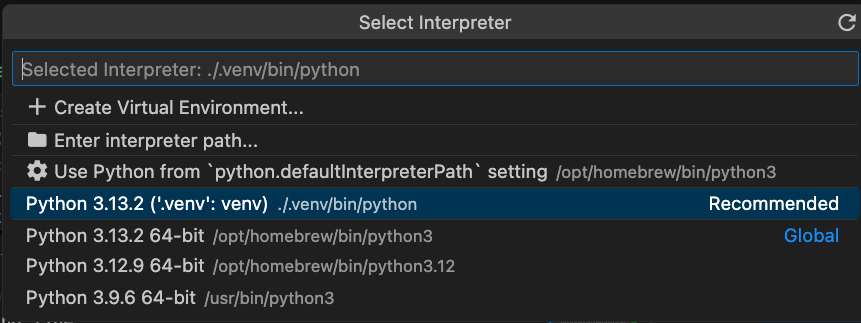
2. **Open Test Suite**:
    - Navigate to `demo/chapter_1/` and open `1__1-3-basic_syntax_structure.robot`.
  
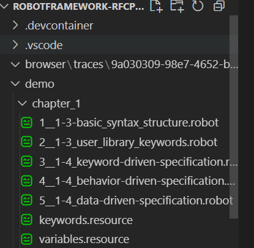
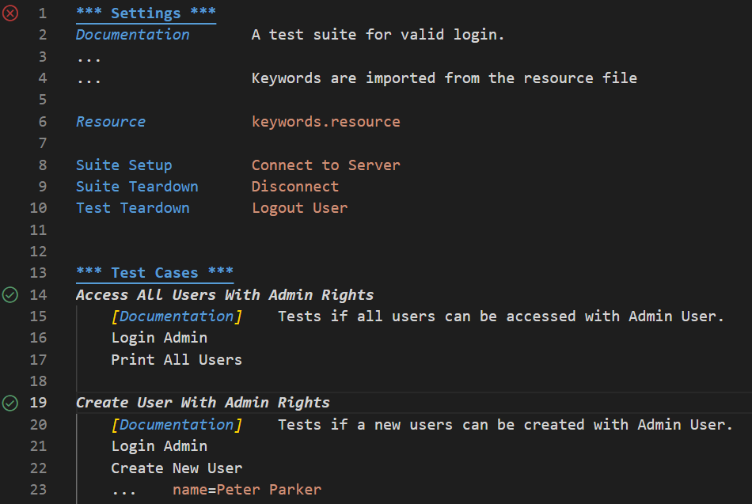

3. **Run Test Suite**:
    - Click on the run icon in line 1 to execute the entire test suite.
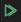
    - Alternatively, you can run individual test cases.
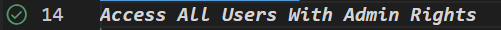
4. **Verify Test Execution**: The test cases should execute successfully with the result `PASS`.
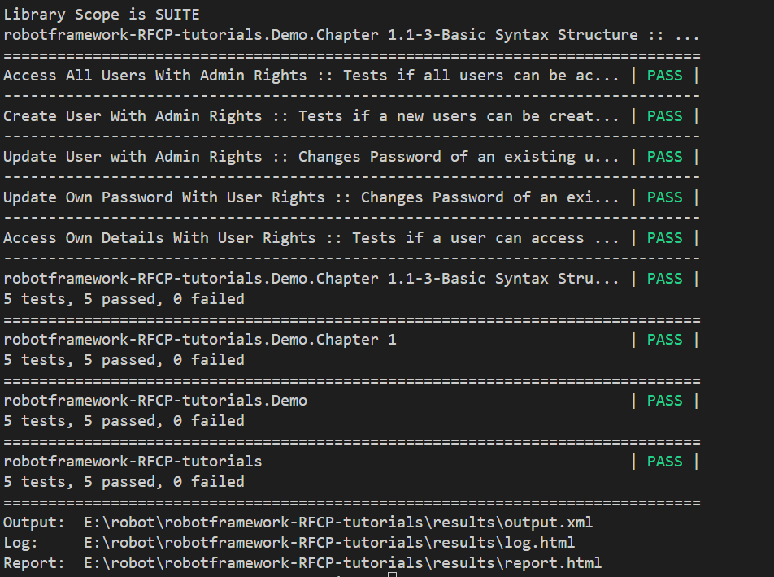

Preparation is now successfully completed.

### Alternative Installation Processes

If local installation and usage of VS Code is not feasible, you can use the following alternative installation processes:

#### Launching a Local DevContainer within VSCode

1. **Install Docker**: Ensure Docker is installed and running on your machine. You can download it from [Docker's website](https://www.docker.com/products/docker-desktop).
2. **Open VS Code**.
3. **Open the Project Folder**:
    - Click on `File` -> `Open Folder`.
    - Select the project folder containing the `.devcontainer` configuration.
4. **Reopen in Container**:
    - Press `F1` to open the command palette.
    - Type `Dev Containers: Reopen in Container` and select it.
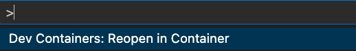
5. **Wait for the Container to Build**: VS Code will build the container and reopen the project inside the container.
6. **Verify Environment**:
    - Open a terminal in VS Code.
    - Run `python --version` and `robot --version` to ensure the environment is set up correctly.

#### Using GitHub Codespaces with the Provided DevContainer

1. **Open GitHub Repository**: Navigate to the [GitHub repository](https://github.com/imbus/robotframework-RFCP-tutorials) containing the project.
2. **Create a Codespace**:

- Click on the `Code` button.

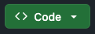

- Select `Codespaces`.

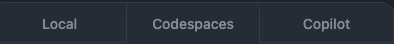

- Click on `Create codespace on main`.

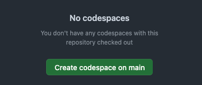

3. **Wait for Codespace to Initialize**: GitHub will create a new codespace and set up the environment based on the `.devcontainer` configuration.
4. **Verify Environment**:
    - Open a terminal in the Codespace.
    - Run `python --version` and `robot --version` to ensure the environment is set up correctly.

These alternative installation processes allow you to use a pre-configured development environment, either locally with DevContainers or remotely with GitHub Codespaces, if local installation and usage of VS Code is not feasible.
